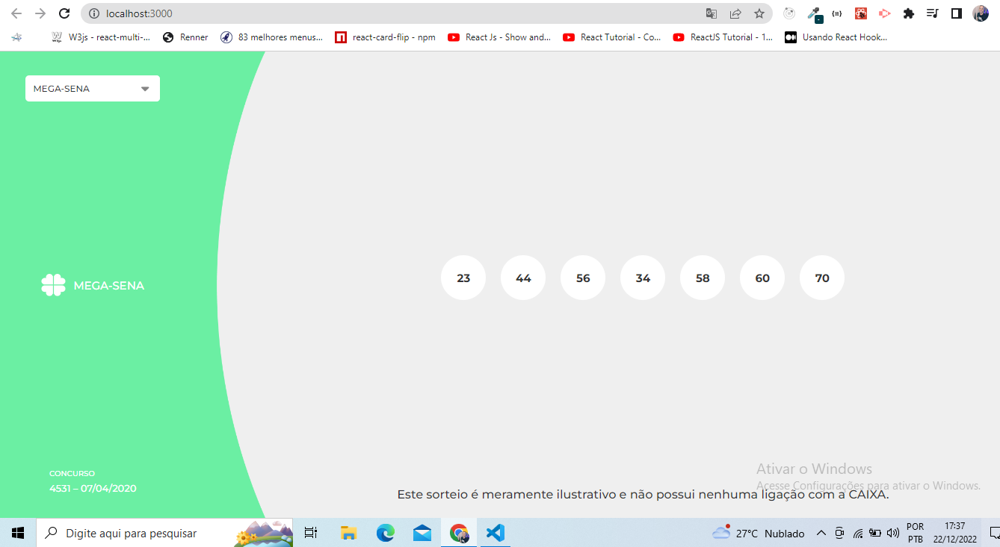

<h1 align="center">Lotter Games</h1>
<h4 align="center">
   
</h4>

  <a href="#tecnologias">Tecnologias</a>&nbsp;&nbsp;&nbsp;|&nbsp;&nbsp;&nbsp;
  <a href="#-como-usar">Como usar</a>&nbsp;&nbsp;&nbsp;|&nbsp;&nbsp;&nbsp;
  <a href="#features">Features</a>&nbsp;&nbsp;&nbsp;|&nbsp;&nbsp;&nbsp;
  <a href="#pencil-autor">Autor</a>

## :page_facing_up: Sobre

Projeto que desenvolvi com o objetivo de melhorar minhas habilidades e conhecimentos tanto em ReactJS quanto em programação Web em geral. O projeto é baseado em resultados de jogos de loterias.

No projeto tentei utilizar boas práticas de desenvolvimento, como separação de componentes, para assim facilitar a reutilização em múltiplos arquivos e teste funcionais.

## :wrench: Tecnologias

<!--EXEMPLO:-->

- [React](https://pt-br.reactjs.org/)
- [Typescript](https://www.typescriptlang.org/)
- [React Testing Lybrary](https://testing-library.com/docs/react-testing-library/intro/)
- [Css-Flexbox](https://www.devmedia.com.br/css3-flexbox-funcionamento-e-propriedades/29532)
- [Css-Grid-Layout](https://www.origamid.com/projetos/css-grid-layout-guia-completo/)

## 💻 Como usar

- Clone o projeto: `git clone https://github.com/Gabriel200395/lotter-games.git`
- Entrar na pasta do projeto: `cd lotter-games`
- Iniciar a aplicação: `yarn lotter-games`
- baixe na aplicação: `yarn`
- testa aplicação: `yarn test`

Irá abrir uma página no browser (se não abrir, vá até [http://localhost:3000](http://localhost:3000/)).

## :heart_eyes: Features

<h3 align="left">Tela Mega Sena 😍.</h3>
<h4 align="left">
   
</h4>

<h3 align="left">Tela Quina 😍.</h3>
<h4 align="left">
   
</h4>

<h3 align="left">Tela Lotofácil 😍.</h3>
<h4 align="left">
   
</h4>

<h3 align="left">Tela Lotomanía 😍.</h3>
<h4 align="left">
   
</h4>

<h3 align="left">Tela Timemania 😍.</h3>
<h4 align="left">
   
</h4>

<h3 align="left">Tela Dia de Sorte 😍.</h3>
<h4 align="left">
   
</h4>

<h3 align="left">Aplicação responsivo ❤.</h3>
<h4 align="left">
   
</h4>

<h3 align="left">Testando aplicação ❤.</h3> 
<h4 align="left">
   
</h4>
## :pencil: Autor

<table>
  <tr>
    <td align="center"><a href="https://github.com/Gabriel200395"> <b>Gabriel Souza</b></a> </td>
  <tr>
</table>
